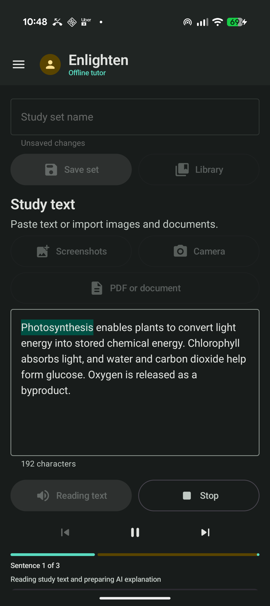
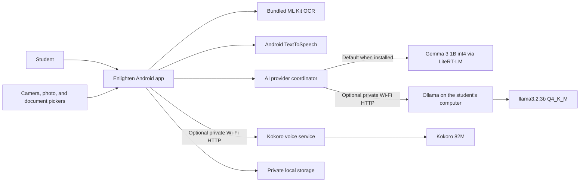

<p align="center">
  
</p>

<h1 align="center">Enlighten</h1>

<p align="center"><strong>Turn the material in front of you into something you can hear, understand, and study.</strong></p>

Enlighten is a local-first Android study companion. It extracts text from screenshots, camera photos, PDFs, DOCX files, and TXT files; reads the material aloud with live highlighting; and turns it into a simpler explanation, flashcards, quiz prompts, and a passage-grounded tutor conversation.

The application was built with Codex powered by GPT-5.6 (`gpt-5.6-sol`) for the OpenAI Build Week Education track. It can run Gemma 3 1B directly on a compatible Android phone through LiteRT-LM, with a free local Ollama model on the student's computer as an optional higher-quality provider. There is no paid inference API, account, or cloud application backend.



## Why Enlighten

Students often receive material in the least convenient form for learning: a photograph of a board, a dense PDF, a screenshot, or a textbook paragraph. Reading the words is only the first step. The student may also need the material spoken slowly, explained simply, converted into practice questions, and saved for later.

Enlighten brings that workflow into one Android app:

1. Capture or paste the material.
2. Listen with sentence controls and live word highlighting.
3. Generate a structured local-AI explanation.
4. Continue directly into flashcards, quiz mode, or Ask Tutor.
5. Save the complete study set privately on the phone.

## Working Features

| Area | Capability |
|---|---|
| Text input | Paste or edit study text |
| Image OCR | Import up to ten screenshots at once using bundled on-device ML Kit OCR |
| Camera OCR | Take a full-resolution photo and append recognized text |
| Documents | Import PDF, DOCX, and UTF-8 TXT files through the Android system picker |
| Read aloud | Offline Android text-to-speech voices, speed control, stop, pause/resume, previous, and next |
| Reading focus | Live spoken-word highlighting and a persistent Now Reading panel |
| AI handoff | Prepare an explanation while the source is spoken, then read the explanation automatically |
| Explanations | Simple explanation, important terms, key points, and quiz questions |
| Study tools | Six editable flashcards and a self-check quiz mode |
| Ask Tutor | Passage-grounded follow-up questions with recent conversation context |
| AI providers | Auto, private on-device Gemma 3 1B, or optional computer Ollama mode |
| Library | Save, open, rename, update, and delete complete study sets |
| Personalization | Persistent profile image, four color palettes, system dark mode, voice, and speed settings |
| Natural narration | Optional Kokoro neural voices generated locally with Android TTS fallback |

## Architecture



The phone owns the interface, OCR, document processing, playback, saved study sets, and the default AI runtime. **Phone** mode runs the 584 MB `gemma3-1b-it-int4.litertlm` model entirely in private app storage and never sends study text to the computer. **Auto** prefers the installed phone model and falls back to Ollama if phone inference fails. **Computer** uses `llama3.2:3b`, a roughly 2 GB quantized model, for stronger answers when the student's PC is reachable. Optional natural narration sends one sentence at a time to Kokoro on that computer and caches the returned WAV audio in Android's cache.

## Technology

- Kotlin 2.3.20 and Java 17
- Jetpack Compose with Material 3
- AndroidX Lifecycle and Navigation 3
- Bundled ML Kit Text Recognition 16.0.1
- Android `TextToSpeech`, `PdfRenderer`, Activity Result APIs, and Storage Access Framework
- Kokoro `kokoro-en-v0_19` through sherpa-onnx 1.13.4
- Kotlin coroutines and `StateFlow`
- LiteRT-LM 0.14.0 with Gemma 3 1B instruction-tuned int4 inference on Android CPU
- Ollama `/api/generate` with `llama3.2:3b`
- Atomic private-file persistence for study sets and profile images

See [TECHNICAL_REPORT.md](TECHNICAL_REPORT.md) for the full architecture, API, performance, security, scalability, and roadmap assessment.

## Quick Start

### Requirements

- Android 8.0 or newer
- Android Studio and SDK 36 for development builds
- Approximately 1.4 GB of free phone storage while importing the 584 MB Gemma model
- Optional: Windows computer with Ollama and `llama3.2:3b`
- Python 3.10 or newer for optional natural narration
- Phone and computer on the same trusted Wi-Fi only when using Ollama or Kokoro

### 1. Install phone AI

Open **Settings > AI tutor**, tap **Get model**, accept the Gemma license on Hugging Face, and download `gemma3-1b-it-int4.litertlm`. Tap **Import** and select the downloaded file. When the status reads **Ready offline**, choose **Phone** for strict on-device processing or **Auto** to keep the computer fallback.

The model is copied into private no-backup app storage. The original file in Downloads can be removed after a successful import if space is needed.

### 2. Install the optional natural voice

```powershell
./install-local-voice.ps1
```

The installer stores the roughly 340 MB Kokoro model under `%LOCALAPPDATA%\Enlighten\tts`, outside OneDrive and outside the Git repository.

### 3. Start the optional computer services

```powershell
ollama pull llama3.2:3b
./configure-enlighten-firewall.ps1
./start-enlighten-services.ps1
```

Run the firewall script from an Administrator PowerShell window when setting up a computer for the first time. The service helper starts Ollama on port `11434` and the optional natural voice service on port `11435`. Use them only on a trusted private network. Do not forward either port from the router.

### 4. Find the computer address

Run `ipconfig`, find the active Wi-Fi IPv4 address, and enter this in Enlighten:

```text
http://YOUR_COMPUTER_IP:11434
```

For example, a private home address may look like `http://192.168.1.100:11434`.

### 5. Build and test

```powershell
$env:JAVA_HOME='C:\Program Files\Android\Android Studio\jbr'
./gradlew.bat testDebugUnitTest lintDebug assembleDebug --no-parallel --no-configuration-cache
```

### 6. Install on Android

Enable Developer options and USB debugging, connect the phone, then run:

```powershell
adb devices
./gradlew.bat installDebug --no-parallel --no-configuration-cache
```

Open Enlighten and import the phone model for fully offline explanations, card generation, and Ask Tutor. To use Ollama, choose **Computer**, enter the computer address, and tap **Test connection**. Choose **Natural local** under Settings to use Kokoro; the app derives port `11435` from the same computer address. OCR, Android voice, saved study sets, and on-device Gemma work without the computer or Wi-Fi.

Android build output is intentionally redirected to `%USERPROFILE%\.gradle\studyreader-build\StudyReader` because OneDrive can lock short-lived Gradle intermediates.

## Demo Passage

A prepared passage and exact demo flow are available in [submission/DEMO_DATA.md](submission/DEMO_DATA.md).

## Privacy Model

- Images and documents are processed on the phone.
- Study sets and profile images are stored in the app's private files.
- No API key, account, analytics SDK, or cloud AI service is used.
- In Phone mode, AI text stays on the phone and Gemma runs in private app storage.
- In Auto mode, the app may send AI text to the configured Ollama computer only if phone inference fails.
- In Computer mode, AI text travels over the local network to the user-configured Ollama computer.
- Natural narration sends sentence text to the user-owned Kokoro service and caches only generated audio in Android's cache.
- The prototype uses cleartext HTTP on the private LAN and must not expose ports `11434` or `11435` to the public internet.

## How Codex Helped

Codex powered by GPT-5.6 served as the engineering collaborator across the full product lifecycle. It inspected the existing code before each change, implemented the Compose interface and local data flows, connected ML Kit OCR and Ollama, built the TTS narration state machine, added persistent study sets and profile images, diagnosed Android device behavior, ran Gradle tests and lint, and produced a measured architecture review.

The human builder directed the product: defining the student workflow, choosing a no-paid-API privacy model, testing the experience on a Pixel 9, and deciding which learning features mattered. Codex turned those decisions into a working Android application and repeatedly verified the result on real hardware.

The Build Week task metadata confirmed the model as `gpt-5.6-sol`. The submitted `/feedback` session ID is `019f2ab8-44a3-76a0-bf9b-600cc6b03cee`.

## Current Limitations

- The 1B phone model is less capable and occasionally less precise than the optional 3B computer model.
- On-device inference uses roughly 1 GB of RAM and may warm the phone during repeated generations.
- Natural local narration requires the Kokoro service; Android TTS remains the automatic fallback.
- OCR currently uses the bundled Latin-script recognizer.
- Long documents need token-aware chunking before reliable whole-document AI synthesis.
- The current distributable is a debug build, not a Play Store release.
- Ollama and Kokoro are unauthenticated cleartext HTTP services in the MVP and should remain on a trusted private network.

## Roadmap

- Add token-aware document chunking and source citations.
- Reject stale AI responses when the active passage changes.
- Migrate study sets to Room and settings to DataStore.
- Add persistent mastery and spaced repetition.
- Add token streaming, cancellation, and Android GPU/NPU acceleration for phone inference.
- Improve small-model grounding and add source-linked answers for long documents.

## Build Week Submission

Submission-ready copy, demo data, video direction, and the final checklist live in [submission](submission/). The project is entered in the **Education** category.

## License

Enlighten is available under the [MIT License](LICENSE).
