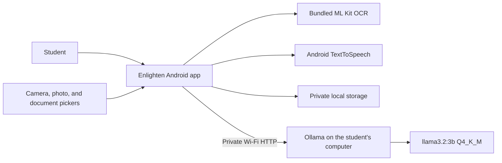

<p align="center">
  
</p>

<h1 align="center">Enlighten</h1>

<p align="center"><strong>Turn the material in front of you into something you can hear, understand, and study.</strong></p>

Enlighten is a local-first Android study companion. It extracts text from screenshots, camera photos, PDFs, DOCX files, and TXT files; reads the material aloud with live highlighting; and turns it into a simpler explanation, flashcards, quiz prompts, and a passage-grounded tutor conversation.

The application was built with Codex for the OpenAI Build Week Education track. It uses Android services on the phone and a free local Ollama model on the student's computer. There is no paid inference API, account, or cloud application backend.


## Why Enlighten

Students often receive material in the least convenient form for learning: a photograph of a board, a dense PDF, a screenshot, or a textbook paragraph. Reading the words is only the first step. The student may also need the material spoken slowly, explained simply, converted into practice questions, and saved for later.

Enlighten brings that workflow into one Android app:

1. Capture or paste the material.
2. Listen with sentence controls and live word highlighting.
3. Generate a structured local-AI explanation.
4. Continue directly into flashcards, quiz mode, or Ask Tutor.
5. Save the complete study set privately on the phone.

## Working Features

| Area | Capability |
|---|---|
| Text input | Paste or edit study text |
| Image OCR | Import up to ten screenshots at once using bundled on-device ML Kit OCR |
| Camera OCR | Take a full-resolution photo and append recognized text |
| Documents | Import PDF, DOCX, and UTF-8 TXT files through the Android system picker |
| Read aloud | Offline Android text-to-speech voices, speed control, stop, pause/resume, previous, and next |
| Reading focus | Live spoken-word highlighting and a persistent Now Reading panel |
| AI handoff | Prepare an explanation while the source is spoken, then read the explanation automatically |
| Explanations | Simple explanation, important terms, key points, and quiz questions |
| Study tools | Six editable flashcards and a self-check quiz mode |
| Ask Tutor | Passage-grounded follow-up questions with recent conversation context |
| Library | Save, open, rename, update, and delete complete study sets |
| Personalization | Persistent profile image, four color palettes, system dark mode, voice, and speed settings |

## Architecture



The phone owns the interface, OCR, document processing, speech, and saved study sets. AI prompts go only to the Ollama instance configured by the student. The current model is `llama3.2:3b`, a roughly 2 GB quantized local model selected because it runs quickly on consumer hardware while producing useful study explanations.

## Technology

- Kotlin 2.3.20 and Java 17
- Jetpack Compose with Material 3
- AndroidX Lifecycle and Navigation 3
- Bundled ML Kit Text Recognition 16.0.1
- Android `TextToSpeech`, `PdfRenderer`, Activity Result APIs, and Storage Access Framework
- Kotlin coroutines and `StateFlow`
- Ollama `/api/generate` with `llama3.2:3b`
- Atomic private-file persistence for study sets and profile images

See [TECHNICAL_REPORT.md](TECHNICAL_REPORT.md) for the full architecture, API, performance, security, scalability, and roadmap assessment.

## Quick Start

### Requirements

- Android 8.0 or newer
- Windows computer with Android Studio and SDK 36
- Ollama with `llama3.2:3b`
- Phone and computer on the same trusted Wi-Fi network for AI features

### 1. Start the local model

```powershell
ollama pull llama3.2:3b
./start-ollama.ps1
```

The helper starts Ollama on port `11434`. Use it only on a trusted private network. Do not forward that port from the router.

### 2. Find the computer address

Run `ipconfig`, find the active Wi-Fi IPv4 address, and enter this in Enlighten:

```text
http://YOUR_COMPUTER_IP:11434
```

For example, a private home address may look like `http://192.168.1.100:11434`.

### 3. Build and test

```powershell
$env:JAVA_HOME='C:\Program Files\Android\Android Studio\jbr'
./gradlew.bat testDebugUnitTest lintDebug assembleDebug --no-parallel --no-configuration-cache
```

### 4. Install on Android

Enable Developer options and USB debugging, connect the phone, then run:

```powershell
adb devices
./gradlew.bat installDebug --no-parallel --no-configuration-cache
```

Open Enlighten, enter the computer address, and tap **Test connection**. OCR, TTS, the local library, and saved settings work on the phone without the computer. Explanation, card generation, and Ask Tutor currently require the configured Ollama computer.

Android build output is intentionally redirected to `%USERPROFILE%\.gradle\studyreader-build\StudyReader` because OneDrive can lock short-lived Gradle intermediates.

## Demo Passage

A prepared passage and exact demo flow are available in [submission/DEMO_DATA.md](submission/DEMO_DATA.md).

## Privacy Model

- Images and documents are processed on the phone.
- Study sets and profile images are stored in the app's private files.
- No API key, account, analytics SDK, or cloud AI service is used.
- AI text travels over the local network to the user-configured Ollama computer.
- The prototype uses cleartext HTTP on the private LAN and must not be exposed to the public internet.

## How Codex Helped

Codex served as the engineering collaborator across the full product lifecycle. It inspected the existing code before each change, implemented the Compose interface and local data flows, connected ML Kit OCR and Ollama, built the TTS narration state machine, added persistent study sets and profile images, diagnosed Android device behavior, ran Gradle tests and lint, and produced a measured architecture review.

The human builder directed the product: defining the student workflow, choosing a no-paid-API privacy model, testing the experience on a Pixel 9, and deciding which learning features mattered. Codex turned those decisions into a working Android application and repeatedly verified the result on real hardware.

## Current Limitations

- Local AI requires network access to a computer running Ollama.
- OCR currently uses the bundled Latin-script recognizer.
- Long documents need token-aware chunking before reliable whole-document AI synthesis.
- The current distributable is a debug build, not a Play Store release.
- Ollama is unauthenticated cleartext HTTP in the MVP and should remain on a trusted private network.

## Roadmap

- Add token-aware document chunking and source citations.
- Reject stale AI responses when the active passage changes.
- Migrate study sets to Room and settings to DataStore.
- Add persistent mastery and spaced repetition.
- Add an on-device AI provider for compatible Android phones.
- Keep Ollama as an optional higher-quality local provider.

## Build Week Submission

Submission-ready copy, demo data, video direction, and the final checklist live in [submission](submission/). The project is entered in the **Education** category.

## License

Enlighten is available under the [MIT License](LICENSE).
