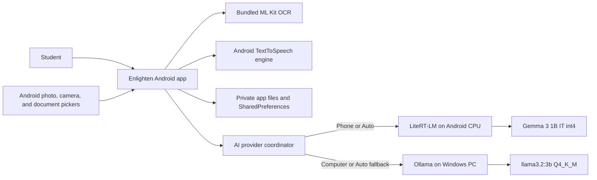
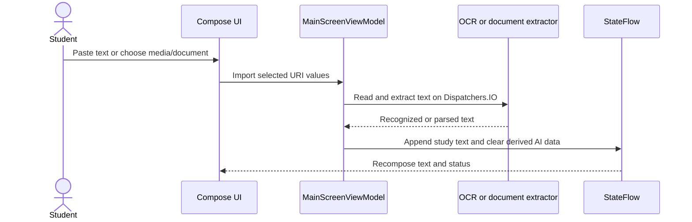
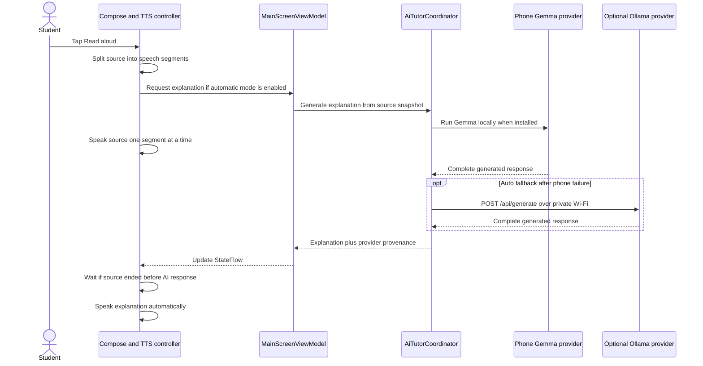
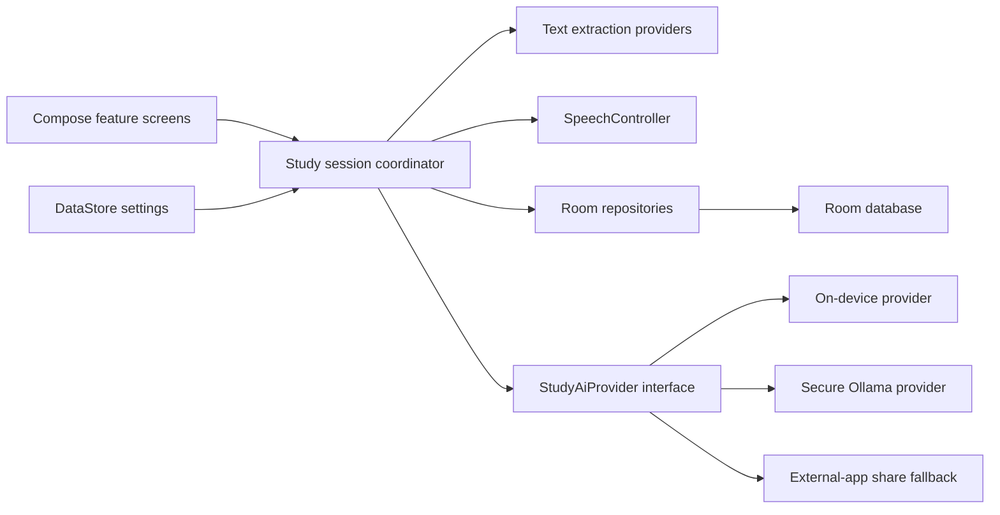

# Enlighten Technical Architecture Report

**Assessment date:** 2026-07-21
**Assessed workspace:** `C:\Users\User\OneDrive\Documents\college app\StudyReader`  
**Application:** Enlighten for Android  
**Package:** `com.example.studyreader`  
**Current version:** `1.0` (`versionCode 1`)  
**Report audience:** Software architects and AI engineers who do not have access to the source code

## 1. Executive Summary

Enlighten is a functional Android study assistant MVP. A student can paste text, extract text from screenshots, camera photos, PDFs, DOCX files, and TXT files, listen to the material through Android text-to-speech, generate a simplified explanation with a local language model, create flashcards, run a self-check quiz, ask passage-grounded tutor questions, and save study sets locally.

The Android application performs document selection, OCR, storage, interface rendering, speech, and default AI inference on the phone. Gemma 3 1B instruction-tuned int4 runs through LiteRT-LM 0.14.0 from a 584,417,280-byte model copied into private no-backup storage. The user can select Auto, Phone, or Computer mode. Phone mode never routes study text to a computer. Auto prefers Gemma and falls back to Ollama; Computer mode explicitly uses `llama3.2:3b` on the user's Windows PC. No paid cloud API or Enlighten-owned application backend is involved.

The product is beyond a proof of concept: its core study workflow is implemented, the APK builds, 18 unit tests pass, lint passes, and key workflows have been smoke-tested on a Pixel 9. Real-hardware tests with Wi-Fi and mobile data disabled completed an explanation in about 10 seconds, generated six flashcards in about 5 seconds, and answered a tutor question on the phone model. It is not yet production-ready. The main blockers are long-document context handling, stale asynchronous AI results, non-streaming generation without cancellation, optional Ollama cleartext transport, PDF bitmap limits, incomplete backup/privacy controls, and the absence of release signing and Play Store configuration.

The on-device-first architecture scales horizontally with installations because every compatible phone supplies its own inference capacity. There is no shared Enlighten service to overload. Optional Ollama remains appropriate for one student and one computer on a trusted network but is not a shared service architecture. Production work should harden model lifecycle, memory/thermal behavior, context processing, request cancellation, and release distribution while retaining Ollama as an opt-in higher-quality provider.

## 2. Assessment Method and Confidence

This report is based on inspection of the Kotlin source, Android resources, Gradle configuration, manifests, tests, generated APK, local Ollama installation, Hugging Face model metadata, and runtime behavior on a Pixel 9 and the development computer. Build, test, lint, APK, model size/checksum, phone inference, CPU, RAM, and GPU values are measured. Latency ranges for OCR, long PDFs, and unsupported user volumes are engineering estimates and are labeled as such.

The report describes the files present on 2026-07-21.

## 3. Current Product Status

**Lifecycle stage:** Feature-complete local MVP, suitable for supervised personal testing.

**Operational model:** One Android phone runs AI locally; a reachable Windows Ollama computer is optional.

**Build status:** `testDebugUnitTest`, `lintDebug`, and `assembleDebug` pass.

**Test inventory:** 18 local unit tests pass. Android instrumentation sources compile. The latest feature set was smoke-tested on a Pixel 9 without clearing user data.

**Distribution status:** Debug APK only. There is no production application ID, release signing, Play App Bundle, Play Store listing, CI/CD workflow, or formal versioning process.

**Current artifact:** `%USERPROFILE%\.gradle\studyreader-build\StudyReader\app\outputs\apk\debug\app-debug.apk`

| Artifact property | Value |
|---|---:|
| File size | 110,856,173 bytes |
| Approximate size | 105.7 MiB |
| Reason for growth | LiteRT-LM native Android runtime libraries |

## 4. Completed Features

| Area | Implemented behavior | Status |
|---|---|---|
| Study input | Paste and edit text in a large study text field | Complete |
| Screenshot OCR | Select up to 10 images at once and append recognized text | Complete |
| Camera OCR | Capture a full-resolution image through the system camera and recognize its text | Complete |
| Document import | Import PDF, DOCX, and UTF-8 TXT files through the Android system picker | Complete |
| Read aloud | Speak study text using Android `TextToSpeech` | Complete |
| Playback controls | Previous sentence, next sentence, pause/resume, stop, speed, and progress | Complete |
| Live highlighting | Highlight the spoken word when the TTS engine provides range callbacks | Complete |
| Automatic explanation | Generate an AI explanation while reading and begin reading it after the source finishes | Complete |
| AI explanation | Return a simple explanation, important terms, key points, and quiz questions | Complete |
| Flashcards | Generate six cards, edit/delete cards, flip cards, and mark self-check mastery | Complete |
| Quiz mode | Show flashcard prompts as a manual self-check quiz | Complete with limitations |
| Ask Tutor | Ask passage-grounded follow-up questions with recent chat history | Complete |
| Saved study sets | Create, open, rename, update, and delete local study sets | Complete |
| Profile photo | Select and persist a profile image in private application storage | Complete |
| Appearance | Teal, Forest, Rose, and Blue palettes with system light/dark mode | Complete |
| Voice settings | Select an installed offline voice and save speech rate | Complete |
| Connection settings | Edit, save, and test the Ollama server address | Complete |
| AI provider settings | Select Auto, Phone, or Computer and see the active privacy path | Complete |
| Phone model lifecycle | Import, validate, replace, and remove Gemma from private no-backup storage | Complete |
| On-device AI | Explanation, flashcards, and Ask Tutor through Gemma 3 1B on Android CPU | Complete and device-tested |
| Privacy baseline | No analytics, account, API key, or cloud application backend | Complete |

The quiz is a self-assessment interface, not an automatically graded quiz. Mastery marks are transient and are not persisted as spaced-repetition history.

## 5. Planned and Candidate Features

No formal issue tracker or product requirements document exists. The following items have been discussed or are natural next steps, but are not implemented:

| Feature | Current state | Recommended disposition |
|---|---|---|
| Android GPU/NPU inference | CPU implemented | Evaluate only after correctness and compatibility testing |
| Model download manager | Manual Hugging Face download/import | Add resumable downloads with license-aware onboarding |
| External AI app sharing | Not implemented | Optional fallback using Android share intents; cannot provide seamless API behavior |
| Spaced repetition | Not implemented | Add persistent scheduling after migrating storage to Room |
| Automatic quiz grading | Not implemented | Add structured answers and deterministic grading rules |
| Cloud sync and accounts | Not implemented | Defer until multi-device demand justifies privacy and infrastructure cost |
| Search, tags, folders | Not implemented | Add once saved-set storage is migrated to a database |
| Native PDF text extraction | Not implemented | Replace OCR for digitally generated PDFs where text is available |
| Multi-language OCR | Not implemented | Add optional ML Kit script packages and language selection |
| Streaming AI output | Not implemented | Add to reduce perceived latency and allow cancellation |
| Citations / retrieval | Not implemented | Add passage references and chunk identifiers before presenting answers as grounded |
| Play Store release | Not implemented | Requires production identity, signing, policy, privacy, and QA work |

## 6. Technology Stack

### 6.1 Build and Language

| Component | Version / configuration |
|---|---|
| Language | Kotlin 2.3.20 |
| Java source compatibility | Java 17 |
| Kotlin JVM toolchain | 17 |
| Gradle wrapper | 9.1.0 |
| Android Gradle Plugin | 9.0.1 |
| Compose compiler plugin | Kotlin Compose plugin 2.3.20 |
| Kotlin serialization plugin | 2.3.20, used for navigation keys |
| Build JDK observed | Android Studio JBR 21.0.10 |
| Gradle maximum heap | 2,048 MB |
| Build caches | Build cache and configuration cache enabled |

The build directory is redirected to `%USERPROFILE%\.gradle\studyreader-build\StudyReader` to avoid file-locking problems caused by building inside a OneDrive-synchronized directory.

### 6.2 Android Platform

| Component | Version / configuration |
|---|---|
| Minimum Android API | 26, Android 8.0 |
| Compile SDK | 36 |
| Target SDK | 36 |
| Application type | Single-activity native Android application |
| UI toolkit | Jetpack Compose |
| Design system | Material 3 |
| Navigation | AndroidX Navigation 3 |
| Supported theme | System light/dark plus four user palettes |

### 6.3 Frameworks and Libraries

| Library | Declared or resolved version | Purpose |
|---|---:|---|
| AndroidX Core KTX | 1.18.0 | Android platform utilities |
| Activity Compose | 1.13.0 | Compose activity integration |
| Lifecycle | 2.10.0 | ViewModel and lifecycle-aware state |
| Navigation 3 | 1.0.1 | Back stack and route rendering |
| Lifecycle Navigation 3 | 2.10.0 | Navigation lifecycle integration |
| Compose BOM | 2026.03.01 | Compose dependency alignment |
| Compose UI / runtime | 1.10.6 resolved | Declarative UI and state runtime |
| Material 3 | 1.4.0 resolved | UI components and theme |
| Material icons extended | 1.7.8 | Interface icons |
| ML Kit Text Recognition | 16.0.1 bundled | On-device Latin-script OCR |
| LiteRT-LM Android | 0.14.0 | On-device Gemma inference and engine lifecycle |
| Kotlin coroutines | 1.9.0 resolved transitively | Background work and flows |
| `org.json` | Android platform | Ollama payload and local JSON handling |
| JUnit | 4.13.2 | Local tests |
| AndroidX Test Core | 1.7.0 | Android tests |
| AndroidX Test Ext JUnit | 1.3.0 | Android JUnit integration |
| AndroidX Test Runner | 1.7.0 | Instrumentation runner |
| Espresso | 3.7.0 | UI test support |
| Coroutines Test | 1.10.2 | Coroutine test support |

There is no Retrofit, OkHttp, Room, DataStore, Hilt, Koin, image-loading framework, analytics SDK, crash-reporting SDK, or cloud service SDK.

## 7. Project Structure

```text
StudyReader/
|-- app/
|   |-- build.gradle.kts
|   `-- src/
|       |-- main/
|       |   |-- AndroidManifest.xml
|       |   |-- java/com/example/studyreader/
|       |   |   |-- MainActivity.kt
|       |   |   |-- Navigation.kt
|       |   |   |-- NavigationKeys.kt
|       |   |   |-- data/
|       |   |   |   |-- CameraImageStore.kt
|       |   |   |   |-- DocumentTextExtractor.kt
|       |   |   |   |-- AiTutorCoordinator.kt
|       |   |   |   |-- OllamaClient.kt
|       |   |   |   |-- OnDeviceStudyTutor.kt
|       |   |   |   |-- ProfileImageStore.kt
|       |   |   |   |-- ScreenshotTextExtractor.kt
|       |   |   |   `-- StudySetStore.kt
|       |   |   |-- ui/main/
|       |   |   |   |-- FlashcardStudyTools.kt
|       |   |   |   |-- MainScreen.kt
|       |   |   |   |-- MainScreenViewModel.kt
|       |   |   |   |-- SettingsContent.kt
|       |   |   |   |-- SpeechText.kt
|       |   |   |   |-- StudySetLibrary.kt
|       |   |   |   `-- TutorChat.kt
|       |   |   `-- ui/theme/
|       |   |       |-- Color.kt
|       |   |       |-- Theme.kt
|       |   |       `-- Type.kt
|       |   `-- res/
|       |       |-- drawable and mipmap launcher assets
|       |       |-- values and values-night resources
|       |       `-- xml FileProvider and backup rule files
|       |-- test/
|       `-- androidTest/
|-- artifacts/Enlighten-debug.apk
|-- build.gradle.kts
|-- gradle.properties
|-- settings.gradle.kts
`-- start-ollama.cmd
```

There are 23 production Kotlin files totaling approximately 4,912 lines and four Kotlin test source files. `MainScreen.kt` and `MainScreenViewModel.kt` contain most product behavior and remain the largest maintainability hotspots.

## 8. System Architecture

Enlighten is an on-device-first system with an optional second compute node. The Android client owns the application, orchestration, and default AI runtime. Ollama is an independently installed optional inference server. There is no Enlighten-owned backend process.



### 8.1 Architectural Boundaries

| Boundary | Responsibility |
|---|---|
| Compose UI | Input, rendering, dialogs, launchers, speech controls, and transient interaction state |
| `MainScreenViewModel` | Core screen state, AI operations, OCR/document imports, study-set operations, and error status |
| Data helpers | File storage, OCR, document extraction, profile image persistence, and HTTP requests |
| Android services | Camera, Storage Access Framework, photo picker, URI grants, and TTS engine |
| `AiTutorCoordinator` | Provider ordering, strict privacy-mode enforcement, and result provenance |
| `OnDeviceStudyTutor` | Model import/validation, LiteRT-LM engine lifecycle, and Android inference |
| Gemma 3 1B | Default explanation, flashcard generation, and tutor answers on the phone |
| Ollama / `llama3.2:3b` | Optional higher-quality computer inference and Auto fallback |

The code uses interfaces around important data helpers, which helps testing, but it does not have formal domain, repository, and use-case layers. Dependencies are manually constructed from Compose when the ViewModel is created.

## 9. End-to-End Data Flow

### 9.1 Text Acquisition



Image OCR is performed entirely on the phone using the bundled Latin-script ML Kit model. PDF pages are rendered to bitmaps and then OCRed. DOCX files are opened as ZIP containers and text is read from `word/document.xml`. TXT files are decoded as UTF-8.

### 9.2 Read and Explain



The AI request and source narration run concurrently. This reduces total wait time. Because both providers currently return non-streaming responses, the explanation cannot be displayed or spoken until generation is complete.

### 9.3 Save and Reload

The current title, source, explanation, flashcards, and tutor messages are serialized into one JSON file in private application storage. Saving or deleting acquires a mutex, reads the complete file, updates the in-memory list, and atomically rewrites the complete file. Opening a saved set replaces the ViewModel's current state.

## 10. AI Model and Runtime

### 10.1 Phone Model Details

| Property | Measured value |
|---|---|
| Model | Gemma 3 1B instruction-tuned |
| Repository | `litert-community/Gemma3-1B-IT` on Hugging Face |
| File | `gemma3-1b-it-int4.litertlm` |
| Quantization | Dynamic int4 QAT |
| Runtime | LiteRT-LM 0.14.0 |
| Backend | Android CPU |
| Context configuration | 2,048 tokens in the packaged LiteRT-LM artifact |
| Stored size | 584,417,280 bytes, about 557.3 MiB |
| SHA-256 | `1325AE366D31950F137C9C357B9FA89448B176D76998180C08CEACA78BBA98BE` |
| Private location | `noBackupFilesDir/ai-models`, excluded from Android backup |
| Measured Pixel 9 latency | Explanation about 10 s; six flashcards about 5 s for a short passage |
| Published Samsung S24 Ultra memory benchmark | About 1,009 MB CPU RSS |

### 10.2 Why Gemma and the Optional Computer Model Were Chosen

Gemma 3 1B is small enough for current flagship Android memory budgets while retaining instruction-following behavior suitable for short study passages. The `.litertlm` package is directly supported by Google's mobile runtime and can be initialized and reused in-process. This removes the computer and Wi-Fi dependency, avoids per-call cost, and keeps strict Phone-mode prompts on the handset. Its trade-offs are weaker reasoning and factual precision, shorter practical context, CPU heat, and device compatibility risk.

The optional `llama3.2:3b` Q4_K_M Ollama model remains useful because the current RTX 3070 runs it quickly and its 3.2 billion parameters generally provide stronger explanations than Gemma 1B. Its stored size is approximately 2.02 GB, observed GPU residency is about 2.6 GB, and the observed runtime context is 4,096 tokens. Computer mode trades phone independence for answer quality; Auto mode uses it only as fallback.

### 10.3 Current Prompt Strategies

The explanation prompt requests four sections: a simple explanation, important terms, key points, and three quiz questions. Temperature is `0.2`.

The flashcard prompt requests exactly six question-and-answer cards. Ollama uses JSON mode at temperature `0.15`. The phone provider uses a compact `Q: ... | A: ...` line format at temperature `0.1`, which is easier for a 1B model to follow. The shared parser accepts JSON, embedded JSON, compact line pairs, and numbered question/answer pairs, returning at most ten cards.

The tutor prompt contains the active passage, the last six tutor conversation messages, and the new question. Temperature is `0.2`. The answer is intended to remain grounded in the passage, but this is prompt guidance rather than a verified retrieval or citation mechanism.

### 10.4 Critical Context Limitation

The Android import layer accepts up to 250,000 characters, while the phone model package has a much smaller usable context and Ollama was observed at 4,096 tokens. A large imported document can therefore exceed either provider's context by more than an order of magnitude.

The application does not count tokens, split text into semantic chunks, summarize chunks, retrieve relevant chunks for tutor questions, or reserve output tokens. Long passages can be truncated by the runtime, lose important sections, produce incomplete explanations, or fail. Increasing `num_ctx` alone is not a complete fix because context memory and prompt-evaluation latency grow significantly. The recommended solution is token-aware chunking plus hierarchical synthesis and retrieval.

## 11. Backend Architecture and API Design

### 11.1 Backend Status

There is no custom Enlighten backend. Phone inference is an in-process Kotlin call to LiteRT-LM and has no HTTP endpoint. When Computer mode or Auto fallback is used, the Android app calls Ollama directly using Java `HttpURLConnection` and `org.json`. The configured base URL defaults to the example `http://192.168.1.100:11434`, can be edited in settings, and is persisted in `SharedPreferences`.

The base URL validator accepts HTTP or HTTPS, a host, and an optional port. Paths, query strings, and fragments are rejected. The HTTP connect timeout is 10 seconds and the read timeout is 180 seconds.

### 11.2 Endpoints

| Method | Endpoint | Purpose | App behavior |
|---|---|---|---|
| `GET` | `/api/tags` | Connection and model availability check | Confirms Ollama is reachable and inspects installed model names |
| `POST` | `/api/generate` | Explanation generation | Sends source prompt, `stream:false`, temperature `0.2`, keep-alive `10m` |
| `POST` | `/api/generate` | Flashcard generation | Sends structured prompt, `format:"json"`, `stream:false`, temperature `0.15` |
| `POST` | `/api/generate` | Tutor answer | Sends passage, recent chat, and question with temperature `0.2` |

Example explanation request:

```json
{
  "model": "llama3.2:3b",
  "prompt": "You are a study tutor...\n\nText:\n<student text>",
  "stream": false,
  "keep_alive": "10m",
  "options": {
    "temperature": 0.2
  }
}
```

The client reads the final `response` field. It does not consume streaming newline-delimited JSON, expose token metrics, retry failed requests, apply exponential backoff, cancel an in-flight socket operation, or attach a request identifier.

### 11.3 API Design Assessment

Direct Ollama access is simple and appropriate for a private prototype. It minimizes code, infrastructure, cost, and data processors. It also exposes a low-level inference service directly to the network and tightly couples the Android client to Ollama's API and a specific model name.

A stronger local design would place a small authenticated gateway on the PC. The gateway would own prompt versions, model selection, chunking, request IDs, queues, rate limits, health checks, and TLS or a secure tunnel. An alternative is to keep direct Ollama access but add a provider interface in the app and secure network access through Tailscale, WireGuard, or a private reverse proxy.

## 12. Android Application Architecture

### 12.1 Activity and Navigation

`MainActivity` enables edge-to-edge rendering, loads the stored palette, applies the Material 3 theme, and renders `MainNavigation`.

Navigation 3 has one actual route, `Main`. Inside that route, an application drawer switches among three sections represented by local state:

| Section | Function |
|---|---|
| Study | Input, imports, narration, AI explanation, flashcards, quiz, and tutor |
| Library | Saved study-set list and management dialogs |
| Settings | Color palette and offline voice selection |

Navigation 3 is currently more infrastructure than the app requires, but it is a reasonable base if Library, Settings, flashcard sessions, and tutor chat become true routes later.

### 12.2 Screen Composition

The Study section is a vertically scrolling Compose layout. It contains title and save actions, source import controls, the study text editor, TTS controls, Ollama connection state, explanation actions and output, flashcard/quiz controls, and tutor chat.

The Library uses a lazy list and modal dialogs for rename and delete operations. Settings displays palette swatches and a voice selection dialog. Photo, camera, and document selection are handled through Android Activity Result APIs and system interfaces rather than custom file browsers.

### 12.3 State Management

Core content state is held in one immutable `MainScreenUiState` exposed as `StateFlow` from `MainScreenViewModel`. The ViewModel uses `viewModelScope` and switches file, OCR, and network work to background dispatchers.

Transient UI and speech state is held with Compose `remember` and `rememberSaveable`. Examples include drawer section, narration phase, current speech segment, highlighted range, flashcard index, quiz mode, and dialog state.

This design survives ordinary recomposition and the ViewModel survives configuration changes. It does not use `SavedStateHandle`, so unsaved study text and active derived state can be lost after process death, force stop, or memory reclamation. Several important asynchronous operation flags also live in a screen-wide state object, which makes unrelated operations difficult to coordinate safely.

### 12.4 Dependency Management

The ViewModel is manually created with concrete OCR, file, store, Ollama, on-device Gemma, and provider-coordinator implementations. No dependency injection framework is used. Manual construction is adequate at this size, but broader provider testing would benefit from a small dependency container or Hilt once the app grows.

## 13. Text Extraction Architecture

### 13.1 Screenshots and Camera

The application uses bundled ML Kit Text Recognition 16.0.1 for Latin-script OCR. Bundling allows recognition without downloading a model at first use. Multiple selected screenshots are processed sequentially, which controls peak memory but makes total time proportional to image count.

Camera capture writes to a temporary private cache file exposed through a non-exported `FileProvider`. Old camera images are cleaned after approximately 24 hours. Extracted text is appended to the source, and stale explanation, cards, and tutor data are cleared.

### 13.2 PDF

PDFs are opened with Android `PdfRenderer`. Up to 60 pages are rendered sequentially into ARGB bitmaps at a target width near 1,600 pixels and passed through OCR. Extracted text is capped at 250,000 characters.

This approach works for scanned PDFs but is inefficient and less accurate for digital PDFs that already contain selectable text. Page width scaling is constrained, but page height and total pixel area are not strictly capped. An unusually tall or malformed page can request a very large bitmap and cause an out-of-memory crash.

### 13.3 DOCX and TXT

DOCX is parsed without a third-party Office library. The file is treated as ZIP, `word/document.xml` is read, and paragraphs, text nodes, and tabs are extracted. The parser disables document type declarations and external entities and limits decompressed XML to 12 MB, reducing ZIP expansion and XML external entity risk.

TXT is decoded as UTF-8. Both formats are capped at 250,000 extracted characters. DOCX headers, footers, footnotes, comments, equations, images, tables with complex structure, and alternate content may not be represented fully.

## 14. Audio Playback and Text-to-Speech

### 14.1 TTS Strategy

Enlighten uses Android's platform `TextToSpeech` engine. It does not synthesize audio itself and does not store generated audio files. Only installed voices whose metadata reports that no network connection is required are offered. The selected voice and rate are persisted.

Source and explanation text are segmented with `BreakIterator.getSentenceInstance(Locale.getDefault())`. Segments are capped near 900 characters, with whitespace fallback splitting. One segment is submitted at a time with `QUEUE_FLUSH`.

### 14.2 Narration State Machine

The speech workflow has four phases:

| Phase | Meaning |
|---|---|
| `Idle` | No active narration |
| `ReadingStudyText` | Source passage is being spoken |
| `WaitingForExplanation` | Source ended before AI generation completed |
| `ReadingExplanation` | AI explanation is being spoken |

Utterance IDs encode the content type, narration generation, and segment index. A generation counter prevents completion callbacks from a previous TTS run from advancing a newer run.

### 14.3 Highlighting and Controls

`UtteranceProgressListener.onRangeStart` supplies character offsets when supported by the installed engine. Callbacks are posted to the main thread and mapped to the active source or explanation so the current word can be highlighted.

Previous and next move by speech segment. Stop invalidates the narration generation and stops the engine. Pause also calls `TextToSpeech.stop()`, so resume starts the current sentence again rather than continuing at the exact audio position. Changing speed affects subsequent synthesis; it does not restart the currently speaking segment.

The current design is robust enough for an MVP but should be extracted into a lifecycle-aware `SpeechController` with explicit events, unit tests, and a single state flow. TTS range callbacks vary by engine and voice, so highlighting must remain a progressive enhancement.

## 15. Persistence Architecture

| Data | Storage | Lifetime |
|---|---|---|
| Study sets | `filesDir/study_sets.json` through `AtomicFile` | Persistent until deletion/uninstall |
| Profile image | `filesDir/profile/profile.jpg` through `AtomicFile` | Persistent until replacement/uninstall |
| Server URL | `SharedPreferences` | Persistent |
| Palette | `SharedPreferences` | Persistent |
| Voice and speech rate | `SharedPreferences` | Persistent |
| Auto-read setting | `SharedPreferences` | Persistent |
| Camera captures | Private cache through `FileProvider` | Temporary, cleanup after about 24 hours |
| Unsaved active state | ViewModel and Compose memory | Lost after process death |

The profile image is decoded to at most 1,024 pixels for input handling and stored at at most 512 pixels as JPEG quality 90. This fixes the earlier issue where a picker URI grant could disappear after reopening the app.

Study-set writes are atomic and mutex-protected, which protects against partial writes and concurrent in-process modification. However, all sets share one JSON document. Every mutation is O(total library size), all records are loaded into memory, one unrecoverable file affects the entire library, and the nominal schema version does not have a formal migration framework. Room is the appropriate next storage layer.

## 16. Performance and Resource Estimates

### 16.1 Development Computer

| Resource | Measured configuration |
|---|---|
| CPU | Intel Core i7-12700KF, 12 cores / 20 threads |
| RAM | 15.83 GiB |
| GPU | NVIDIA GeForce RTX 3070, 8 GiB VRAM |
| Model execution | 100% GPU during observation |

### 16.2 AI Latency Benchmark

A local benchmark used a prompt of approximately 1,561 tokens.

| Condition | Wall time | Load time | Output | Generation rate |
|---|---:|---:|---:|---:|
| Cold model | 8.05 s | 6.17 s | 197 tokens | 133.4 tokens/s |
| Warm model | 2.19 s | 0.29 s | 251 tokens | 133.5 tokens/s |

The app requests a ten-minute keep-alive, so repeated work within a study session is normally warm. Wi-Fi transport usually adds only milliseconds on a healthy LAN. Because responses are non-streaming, the user sees no partial answer. Short requests should commonly finish in roughly 2 to 8 seconds on this computer; long inputs or slower computers can take tens of seconds or exceed the 180-second read timeout.

These benchmark numbers describe this exact machine and prompt. They are not service-level guarantees.

### 16.3 Phone-Side Estimates

| Workload | Estimated behavior |
|---|---|
| One typical screenshot | Approximately 0.2 to 1.5 seconds depending on resolution and device state |
| Ten screenshots | Approximately 2 to 15 seconds because processing is sequential |
| 60-page PDF | Approximately 20 to 90 seconds; scanned complexity and device thermals matter |
| Profile bitmap | Roughly 1 MiB decoded at 512 x 512 ARGB |
| 1,600 x 2,070 PDF page bitmap | Roughly 12.6 MiB ARGB before OCR overhead |
| 250,000-character text | At least about 0.5 MiB as UTF-16, but several copies can exist during UI, prompt, JSON, and save work |

OCR and parsing run away from the main thread, so the interface should remain responsive. Long jobs are not scheduled through WorkManager and do not survive process termination. PDF pages are recycled sequentially, limiting normal peak memory, but unbounded page aspect ratios remain an OOM risk.

### 16.4 APK and Build Performance

The 105.7 MiB debug APK is large for the feature count. LiteRT-LM native libraries, the bundled OCR model, and debug packaging contribute materially; the 557.3 MiB Gemma model is downloaded separately and is not inside the APK. Release minification is disabled, and no release size measurement exists. Production should enable R8/resource shrinking after testing and distribute an Android App Bundle so Play can optimize native delivery.

## 17. Security and Privacy

### 17.1 Positive Properties

| Property | Benefit |
|---|---|
| No paid or cloud AI API | No API key leakage or per-call billing |
| OCR and document parsing on phone | Images and files are not uploaded to a third-party OCR service |
| Private internal file storage | Other ordinary apps cannot directly read saved study data |
| Atomic file writes | Reduced corruption risk on interrupted writes |
| System file and photo pickers | No broad storage permission is required |
| Non-exported FileProvider | Camera cache is exposed only through temporary URI grants |
| Secure DOCX XML settings | DOCTYPE and external entity processing are disabled |
| No analytics or crash SDK | No automatic behavioral telemetry leaves the device |
| Strict Phone provider | Study prompts and generated responses remain on the phone |
| Model in no-backup storage | The 557.3 MiB licensed model is not copied into Android backup |

### 17.2 High-Risk Findings

| Risk | Severity | Impact | Recommended mitigation |
|---|---|---|---|
| Cleartext HTTP to optional Ollama | High when enabled | Anyone able to observe the LAN may read study text, questions, and generated answers | Use Phone mode, a VPN tunnel, HTTPS reverse proxy, or authenticated local gateway; restrict cleartext with a network security config |
| Ollama binds to all interfaces without app authentication | High | Other LAN clients can submit prompts, consume GPU resources, or access the service | Bind to a trusted interface, firewall private profile only, add authentication, never port-forward 11434 |
| Backup behavior is not explicitly constrained | High | Study sets, profile data, and preferences may enter Android cloud/device backup despite local-only expectations | Wire `dataExtractionRules` and `fullBackupContent` into the manifest or disable backup for sensitive data |
| Long documents exceed context silently | High | Incorrect or incomplete AI output may be presented as a complete explanation | Token-aware chunking, visible source coverage, citations, and hard input limits |
| AI prompt injection through source text | Medium | Imported text can direct the model to ignore tutor instructions | Delimit untrusted content, use structured roles where possible, validate outputs, and communicate limitations |
| No encryption or app lock | Medium | Anyone with an unlocked phone or accessible backup can read study data | Optional biometric lock and encrypted storage for sensitive use cases |
| No model output verification | Medium | Hallucinations may teach incorrect material | Ground answers to passage chunks, cite passages, add uncertainty language, and expose source comparison |
| No production privacy policy | Medium | Store release and user trust requirements are unmet | Document local processing, LAN transfer, retention, deletion, and optional future providers |
| Mobile model heat and memory pressure | Medium | Repeated generation can warm the device or be killed under memory pressure | Add capability checks, thermal feedback, cancellation, and lower-resource fallback behavior |
| Gated model license onboarding | Medium | Users can fail setup or misunderstand the separate Gemma terms | Present the license source, exact filename/checksum, storage cost, and removal controls clearly |

The current explicit model name is local, but a hardened installation should also disable Ollama cloud functionality where appropriate and document the setting. Llama model license and attribution requirements must be reviewed before public distribution.

## 18. Reliability, Bugs, Risks, and Technical Debt

### 18.1 Priority Findings

| Priority | Finding | Failure mode |
|---|---|---|
| P0 | 250,000-character input versus limited phone and Ollama contexts | Large documents are truncated, misunderstood, or rejected without clear coverage feedback |
| P0 | AI jobs are not correlated to the source/set version | A response started for one passage can be written into a different study set opened while the request is running |
| P1 | In-flight AI work is not cancelable from the UI | Stop narration does not stop automatic explanation generation; stale work consumes resources and can update state later |
| P1 | Cleartext, unauthenticated Ollama network exposure when enabled | Computer-mode content and GPU service are exposed to the reachable LAN |
| P1 | No phone-generation cancellation or streaming | Long local requests can hold roughly 1 GB of RAM and cannot be stopped cleanly |
| P1 | PDF bitmap pixel area is not bounded | A malformed or extreme page can exhaust phone memory |
| P1 | Backup XML resources are not referenced by the manifest | Sensitive local data may be backed up under platform defaults |
| P1 | No process-death recovery or autosave | Unsaved work is lost when Android kills the process |
| P2 | Model readiness check accepts any `llama3.2:*` tag | Status can say ready while generation still fails because exact `llama3.2:3b` is missing |
| P2 | Whole-library JSON persistence | Save/delete cost and corruption blast radius grow with every set |
| P2 | Non-streaming API with 180-second read | Long waits provide limited feedback and cannot be interrupted cleanly |
| P2 | Failed tutor messages remain as normal student messages | Conversation history can contain a question with no explicit failed/retry state |
| P2 | PDF always uses OCR | Digital PDFs are slower and less accurate than native text extraction |
| P2 | Latin OCR only | Other scripts are unsupported or inaccurate |
| P2 | Transient mastery and manual quiz grading | Learning progress is lost and quiz correctness is not measured |
| P3 | One-route Navigation 3 integration | Extra complexity without current navigation benefit |
| P3 | `MainScreen.kt` and ViewModel are oversized | UI, lifecycle, TTS, launchers, and orchestration are difficult to reason about and test |
| P3 | Package remains `com.example` | Not suitable as a stable production identity |
| P3 | README is behind current behavior | New engineers receive an incomplete product description |

### 18.2 Async Race Detail

Explanation, flashcard, tutor, and import work launches in `viewModelScope`, but job handles and content version identifiers are not retained. If the student starts an explanation, opens another set, or starts a new set before completion, the old result can update the newly active state. TTS generations protect only against stale speech callbacks; they do not protect AI or OCR state.

Each operation should capture an immutable request containing `studySetId`, `sourceHash`, and `revision`. The ViewModel should cancel superseded jobs and apply a result only if those identifiers still match active state.

### 18.3 Test Gaps

The project has useful parser and persistence tests, but lacks comprehensive coverage for ViewModel concurrency, request cancellation, TTS state transitions, process death, PDF dimension limits, large libraries, corrupt or migrated data, model-context behavior, network security, accessibility, and complete device workflows. There is no CI workflow or coverage report.

## 19. Deployment and Operations

### 19.1 Current Developer Build

Prerequisites are Android Studio/JBR, Android SDK 36, and a connected or wirelessly paired Android device.

```powershell
./gradlew testDebugUnitTest lintDebug assembleDebug
adb install -r "$env:USERPROFILE\.gradle\studyreader-build\StudyReader\app\outputs\apk\debug\app-debug.apk"
```

The build output redirection under the user's Gradle directory is intentional because OneDrive can lock generated files.

### 19.2 Ollama Computer Setup

Ollama is optional. For phone-only operation, download `gemma3-1b-it-int4.litertlm` from the licensed Hugging Face repository, then use **Settings > AI tutor > Import**. The app copies and initializes the model in private no-backup storage and selects Phone mode after success.

```powershell
ollama pull llama3.2:3b
ollama run llama3.2:3b
```

`start-ollama.cmd` locates Ollama under `%LOCALAPPDATA%\Programs\Ollama`, checks port 11434, sets `OLLAMA_HOST=0.0.0.0:11434`, and starts the service minimized. The phone must use the computer's current LAN address and be able to reach TCP port 11434.

Production-like local setup should use a stable DHCP reservation, Windows Firewall limited to the private profile and trusted subnet, no router port forwarding, and a secure tunnel or authenticated gateway. A connection check in the app should verify the exact model, effective context, and server capabilities.

### 19.3 Android Installation

The current workflow uses ADB and a debug-signed APK. The phone requires Android 8.0 or newer. USB or wireless debugging is needed only for developer installation, not for ordinary use after installation. Phone AI, OCR, saved sets, and Android TTS work without the computer or any network. The phone and computer must be mutually reachable only for optional Ollama or Kokoro features.

### 19.4 Production Release Requirements

1. Replace `com.example.studyreader` with a controlled application ID.
2. Create and securely manage a release signing key.
3. Configure release build types, R8, resource shrinking, and reproducible versioning.
4. Produce and test a signed Android App Bundle.
5. Add explicit backup, data deletion, privacy, and network security policies.
6. Add CI for tests, lint, release build, dependency review, and artifact checksums.
7. Run instrumentation, accessibility, orientation, low-memory, offline, and supported-device test matrices.
8. Review the Llama/Ollama and bundled library licenses and provide required notices.
9. Prepare Play Console internal testing, privacy disclosures, screenshots, and support contact.

## 20. Scalability Assessment

### 20.1 Important Interpretation

The current product is decentralized. Each compatible phone contributes its own inference capacity, so aggregate AI load does not hit a shared Enlighten server. Distribution, model onboarding, compatibility, updates, and support become the scaling constraints. If many users instead share one optional Ollama computer, inference and network capacity fail quickly.

### 20.2 User-Level Breakdown

| User count | Current architecture behavior | First things that break | Required evolution |
|---:|---|---|---|
| 100 | Feasible as isolated phone installations | Sideloading, gated model setup, device variability, and support load | Signed distribution, model onboarding, capability diagnostics, and compatibility testing |
| 1,000 | Compute scales, operations do not | No update channel, compatibility matrix, consented crash data, or migration discipline | Play distribution, CI/CD, staged rollout, model/version management, and opt-in health diagnostics |
| 10,000 | Phone compute remains decentralized | Licensing/onboarding support, inconsistent thermals and memory, no data migration strategy | Room migrations, device allowlist/fallback, observability, policy/compliance, and staged model updates |
| 100,000 | Current architecture fails as a service design | No autoscaling, authentication, abuse control, quotas, billing controls, data layer, SLOs, disaster recovery, or global routing | On-device inference at the edge or OAuth-secured backend, autoscaled GPU pools, queues, rate limits, streaming, databases, observability, regional privacy controls |

### 20.3 Shared GPU Capacity Illustration

The measured model generated approximately 133 tokens per second with a warm model. A 200-token answer consumes roughly 1.5 seconds of generation time before prompt evaluation and scheduling. One hundred simultaneous requests cannot all receive that latency on one RTX 3070. Without an explicit queue and concurrency controls, contexts compete for VRAM, latency becomes unpredictable, and requests can time out. A simple serialized queue would put the last request several minutes behind the first.

### 20.4 Recommended Scale Strategy

The implemented Gemma/LiteRT-LM provider shifts inference cost and capacity to each phone and fits the application's privacy and no-subscription goal. The next scaling work is model onboarding, device capability detection, foreground execution, token limits, thermal constraints, cancellation, and quality differences.

Ollama should remain an optional `High quality on computer` provider. If a shared cloud tier is ever introduced, it should be a separate opt-in provider behind the same interface rather than changing core study workflows.

## 21. Recommended Target Architecture



Recommended core contracts:

```kotlin
interface StudyAiProvider {
    suspend fun explain(request: ExplainRequest): Flow<AiEvent>
    suspend fun createFlashcards(request: FlashcardRequest): Flow<AiEvent>
    suspend fun askTutor(request: TutorRequest): Flow<AiEvent>
    suspend fun capabilities(): AiCapabilities
}
```

Every request should include a set ID, source revision, selected chunks, prompt version, and cancellation semantics. Every result should include provider, model, latency, covered chunk IDs, and warnings. This makes model switching explicit and prevents stale results from silently contaminating another study set.

## 22. Recommended Improvements

### 22.1 Immediate Correctness and Security

1. Add token-aware chunking, per-chunk summaries, hierarchical synthesis, and chunk retrieval for tutor questions.
2. Add request IDs, active source revisions, retained `Job` handles, cancellation, and stale-result rejection.
3. Cap PDF width, height, and total pixels before bitmap allocation.
4. Verify exact model name and report effective context and server health.
5. Connect backup rules in the manifest or disable sensitive backup.
6. Restrict Ollama to trusted networking and add authentication or a secure tunnel.
7. Persist unsaved drafts with `SavedStateHandle` and periodic local autosave.

### 22.2 Architecture and Maintainability

1. Move speech lifecycle and callbacks into a tested `SpeechController`.
2. Split the main screen into feature-level routes or coordinators with smaller state models.
3. Replace the one-file JSON store with Room entities, transactions, indexes, and migrations.
4. Replace settings `SharedPreferences` with typed DataStore.
5. Introduce `StudyAiProvider` and `TextExtractor` provider contracts.
6. Use structured response schemas and store prompt/model versions with derived content.
7. Add streaming, progress, retry, and user cancellation.
8. Add CI, dependency updates, license inventory, release checks, and coverage reporting.

### 22.3 Product Quality

1. Add native extraction for digital PDFs and retain OCR as fallback.
2. Persist quiz results, mastery, and spaced-repetition due dates.
3. Add citations that link explanation claims to source chunks.
4. Add multi-language OCR and explicit study/TTS language selection.
5. Add library search, tags, export, import, and corruption recovery.
6. Add accessibility testing for TalkBack, dynamic text, contrast, and touch targets.
7. Bound tutor history and archive old messages to prevent unlimited UI and prompt growth.

## 23. Future Roadmap

| Phase | Goal | Deliverables |
|---|---|---|
| Phase 0 | Correctness and privacy | Context-aware chunking, race fixes, cancellation, PDF memory cap, backup policy, exact health checks, secure LAN guidance |
| Phase 1 | Phone AI reliability | Streaming, cancellation, device capability checks, thermal feedback, model download manager, GPU/NPU evaluation |
| Phase 2 | Stable architecture | Room, DataStore, speech controller, feature decomposition, dependency container, CI, expanded tests |
| Phase 3 | Learning quality | Spaced repetition, graded quizzes, persistent mastery, citations, native PDF text, multilingual extraction and speech |
| Phase 4 | Distribution | Production ID/signing, app bundle, Play internal testing, privacy policy, license notices, staged releases |
| Phase 5 | Optional scale | Encrypted sync, accounts, multi-device, or managed AI only if user demand justifies cost and privacy trade-offs |

## 24. Explain This Project to Another AI Engineer

Enlighten is not an Android wrapper around a cloud API. It is a local-first Android application whose phone-side responsibilities include text acquisition, document/OCR processing, state, persistence, interface rendering, speech, and default LLM inference. Gemma 3 1B int4 runs in-process through LiteRT-LM. Ollama `llama3.2:3b` remains an optional second provider reached over private LAN HTTP.

The central product workflow is `source -> speak -> explain -> speak explanation -> study tools`. When automatic explanation is enabled, the app starts the selected model request while source narration begins. `AiTutorCoordinator` enforces provider order: Phone is local-only, Computer is Ollama-only, and Auto prefers an installed phone model before falling back to the computer. Every success carries provider provenance back to the UI. The remaining concurrency flaw is that asynchronous results are not correlated with the source revision that created them.

Input normalization happens on the phone. Screenshots and camera photos go through bundled Latin ML Kit OCR. PDFs are rendered page by page and OCRed, which supports scans but wastes work on digital documents. DOCX is parsed directly from its XML package, and TXT is read as UTF-8. All extracted text converges into one source string, and changing that source invalidates explanation, flashcards, and tutor history.

The Android state model is a single screen-level `StateFlow` plus Compose-local speech and interaction state. This kept the MVP easy to build but now concentrates too many concerns in `MainScreen.kt` and `MainScreenViewModel.kt`. Avoid adding more flags to those files. Extract a study-session coordinator, speech controller, persistence repositories, and AI provider interface. Use immutable request snapshots with IDs and revisions.

The most important non-obvious defect is context size. The app accepts 250,000 characters and sends one prompt, while the phone artifact has a limited context and observed Ollama uses 4,096 tokens. Do not solve this only by increasing context. Build a token-aware document pipeline: normalize, segment by headings/paragraphs, count or estimate tokens, summarize chunks, synthesize explanations, and retrieve relevant chunks for tutor questions. Preserve chunk IDs for coverage and citations.

Gemma/LiteRT-LM was chosen because it removes network dependence and keeps strict Phone-mode text on the handset. The 1B model is fast enough for short passages but weaker and occasionally less precise than the computer model. Ollama was retained because it is free and gives the user a higher-quality local option; it is not an internet-facing backend and must never be exposed as one.

Persistence currently optimizes for simplicity: one atomic JSON file for every study set and SharedPreferences for settings. This is safe enough for a small personal library, but it scales linearly and lacks migrations, indexed queries, and partial recovery. Migrate to Room before adding spaced repetition, search, tags, or sync. Store AI provenance, prompt version, model name, source revision, and chunk coverage alongside generated content.

TTS is sentence-oriented. Pause is implemented by stopping the engine and replaying the current sentence on resume. Live highlighting depends on engine range callbacks and is not universally guaranteed. Preserve this fallback behavior, but isolate it from Compose so narration can be tested as a deterministic event/state machine.

The provider abstraction now exists through `AiTutorCoordinator`, `OnDeviceStudyTutor`, and `OllamaClient`. Preserve the explicit privacy modes and provenance. Next, add request IDs, source revisions, capability detection, cancellation, and streaming; then extract a narrower provider interface that no longer inherits computer-specific health semantics.

In short: preserve the local-first product promise, fix source/version correlation and context handling first, harden LAN transport, then modularize. The current feature set is valuable and coherent; the next engineering work should improve correctness and trust before increasing feature count.

## 25. Reference Documentation

- [Ollama Generate API](https://docs.ollama.com/api/generate)
- [Ollama List Models API](https://docs.ollama.com/api/tags)
- [Ollama FAQ: networking, context, and local processing](https://docs.ollama.com/faq)
- [Android TextToSpeech](https://developer.android.com/reference/android/speech/tts/TextToSpeech)
- [Android UtteranceProgressListener](https://developer.android.com/reference/android/speech/tts/UtteranceProgressListener)
- [ML Kit Text Recognition for Android](https://developers.google.com/ml-kit/vision/text-recognition/v2/android)
- [Android PdfRenderer](https://developer.android.com/reference/android/graphics/pdf/PdfRenderer)
- [Android Storage Access Framework](https://developer.android.com/training/data-storage/shared/documents-files)
- [ML Kit GenAI APIs](https://developers.google.com/ml-kit/genai)
- [ML Kit Prompt API for Gemini Nano](https://developers.google.com/ml-kit/genai/prompt/android/get-started)
- [Google AI Edge LiteRT-LM](https://github.com/google-ai-edge/LiteRT-LM)
- [LiteRT-LM Android documentation](https://ai.google.dev/edge/litert-lm)
- [Gemma 3 1B LiteRT-LM model](https://huggingface.co/litert-community/Gemma3-1B-IT)
- [Gemma 3 model overview](https://ai.google.dev/gemma/docs/core)

## 26. Final Assessment

Enlighten has a strong personal-use MVP foundation and a clear user value proposition. Its current local architecture successfully avoids paid APIs and keeps most data processing on the user's devices. The application should not yet be released broadly because long-document correctness, asynchronous state integrity, LAN security, PDF memory safety, process recovery, and production distribution controls remain unresolved.

The highest-return next milestone is not another visible feature. It is a reliability release that makes every AI result traceable to the correct source revision, makes long-document coverage explicit, adds phone-generation cancellation and streaming, secures the optional computer connection, and protects data through process death and backup. Phone independence is implemented; the next job is making it durable across devices and longer study material.
